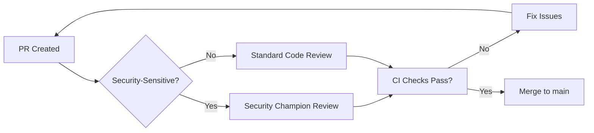

# Secure Software Development Lifecycle (SDLC)

## Overview

This document establishes security practices for the **entire development lifecycle**: code review, testing, deployment, and vulnerability management.

---

## Pull Request Security Checklist

### Mandatory Checks (Before Merge)

**For ALL Pull Requests**:
- [ ] **No secrets committed** (run `git diff main | grep -i "secret\|password\|token"`)
- [ ] **Tests pass** (CI must be green)
- [ ] **Type checking passes** (`npm run check`)
- [ ] **Code reviewed by ≥1 developer** (GitHub required review)
- [ ] **No merge conflicts**

**For Security-Sensitive Changes** (auth, validation, crypto):
- [ ] **Threat model updated** (if attack surface changes)
- [ ] **Security regression test added** (test for vulnerability fix)
- [ ] **Documentation updated** (security docs in `docs/security/`)
- [ ] **Reviewed by security champion** (designated team member)

**For Dependency Changes**:
- [ ] **`npm audit` passes** (no HIGH or CRITICAL vulnerabilities)
- [ ] **Lockfile updated** (`package-lock.json` committed)
- [ ] **Change log reviewed** (check for breaking security changes)

---

### Code Review Standards

#### Security-Focused Review Questions

1. **Authentication/Authorization**:
   - Does this endpoint require authentication? (`isAuthenticated` middleware present?)
   - Is authorization checked? (user can only access own resources?)
   - Are permissions validated at the database layer? (`userId` in WHERE clause?)

2. **Input Validation**:
   - Are all inputs validated with Zod schemas?
   - Are length limits enforced? (folder names, file names)
   - Are file uploads size-checked?

3. **SQL Injection**:
   - Is Drizzle ORM used for all queries? (no raw SQL strings?)
   - Are dynamic queries parameterized?

4. **XSS Prevention**:
   - Is user input escaped before rendering? (React JSX auto-escapes)
   - Are there any `dangerouslySetInnerHTML` usages? (must be justified)

5. **Path Traversal**:
   - Are file paths validated? (`normalizeObjectEntityPath()` used?)
   - Are user-supplied paths sanitized? (no `../` sequences)

6. **Error Handling**:
   - Are error messages generic? (no stack traces or internal details?)
   - Are errors logged server-side? (for debugging)

7. **Secrets**:
   - Are secrets loaded from environment variables? (not hardcoded)
   - Are API keys redacted in logs?

---

### Review Workflow



---

## Security Regression Tests

### What is a Security Regression Test?

A test that **specifically validates a security fix** to ensure the vulnerability doesn't reoccur.

### Example: SQL Injection Fix

**Vulnerability**: Raw SQL string concatenation in folder query (hypothetical)

**Fix**: Switch to Drizzle ORM parameterization

**Regression Test**:
```typescript
describe('SQL Injection Prevention', () => {
  it('should reject malicious folder ID', async () => {
    const maliciousId = "'; DROP TABLE folders; --";
    
    const response = await request(app)
      .get(`/api/folders/${maliciousId}`)
      .set('Cookie', mockSessionCookie());
    
    expect(response.status).toBe(404); // Not found (ID invalid format)
    
    // Verify tables still exist
    const folders = await db.query.folders.findMany();
    expect(folders).toBeDefined();
  });
});
```

---

### Example: Path Traversal Fix

**Vulnerability**: GCS path validation missing (hypothetical)

**Fix**: Add `normalizeObjectEntityPath()` validation

**Regression Test**:
```typescript
describe('Path Traversal Prevention', () => {
  it('should reject path traversal attempts', () => {
    const maliciousPaths = [
      '/objects/../admin/secrets.txt',
      '/admin/config.json',
      '../../etc/passwd',
    ];
    
    for (const path of maliciousPaths) {
      expect(() => normalizeObjectEntityPath(path)).toThrow('Invalid object path');
    }
  });
  
  it('should accept valid object paths', () => {
    const validPaths = [
      '/objects/abc-123-def-456',
      'gs://bucket/objects/file.txt',
    ];
    
    for (const path of validPaths) {
      expect(() => normalizeObjectEntityPath(path)).not.toThrow();
    }
  });
});
```

---

## Security Testing Requirements

### Unit Tests (Per Feature)
- **Coverage Target**: 100% (documented exceptions allowed)
- **Security Focus**: Input validation, authorization checks

### Integration Tests (Per API Endpoint)
- **Coverage**: All authenticated endpoints
- **Security Focus**: End-to-end auth flow, permission checks

### Security-Specific Tests
```typescript
describe('Security Controls', () => {
  describe('Authentication', () => {
    it('should reject unauthenticated requests', async () => {
      const response = await request(app).get('/api/folders');
      expect(response.status).toBe(401);
    });
  });
  
  describe('Authorization', () => {
    it('should prevent horizontal privilege escalation', async () => {
      const userA = createMockUser('user-a');
      const userBFileId = 'file-owned-by-user-b';
      
      const response = await request(app)
        .post(`/api/files/${userBFileId}/share`)
        .set('Cookie', mockSessionCookie(userA));
      
      expect(response.status).toBe(404); // Not 403 to avoid info disclosure
    });
  });
  
  describe('Input Validation', () => {
    it('should reject invalid file size', async () => {
      const response = await request(app)
        .post('/api/files')
        .send({ size: -1, name: 'test.txt' });
      
      expect(response.status).toBe(400);
    });
  });
});
```

---

## Vulnerability Disclosure Process

### External Researchers (Security Bug Bounty)

**Reporting Channel**: Create `SECURITY.md` in repository root
```markdown
# Security Policy

## Supported Versions

| Version | Supported          |
| ------- | ------------------ |
| 1.x     | :white_check_mark: |

## Reporting a Vulnerability

**DO NOT** open public GitHub issues for security vulnerabilities.

Email: security@cloudvault.example.com

Include:
- Description of vulnerability
- Steps to reproduce
- Potential impact
- Suggested fix (optional)

We aim to respond within **48 hours** and provide a fix within **7 days** for critical issues.
```

---

### Internal Vulnerability Discovery

**Process**:
1. **Report**: Developer reports to security team (Slack #security channel)
2. **Assess**: Security team evaluates severity (use CVSS calculator)
3. **Track**: Create private GitHub Security Advisory
4. **Fix**: Assign to developer, set deadline based on severity
5. **Test**: Add security regression test
6. **Deploy**: Hotfix to production (emergency process if HIGH/CRITICAL)
7. **Disclose**: Publish security advisory after fix deployed (30 days max)

---

### Severity Rubric (CVSS-based)

| Severity | CVSS Score | Response Time | Examples |
|----------|------------|---------------|----------|
| **CRITICAL** | 9.0-10.0 | 24 hours | SQL injection with data access, RCE |
| **HIGH** | 7.0-8.9 | 7 days | Authentication bypass, privilege escalation |
| **MEDIUM** | 4.0-6.9 | 30 days | XSS (non-stored), CSRF, info disclosure |
| **LOW** | 0.1-3.9 | 90 days | Verbose error messages, missing security headers |

**CVSS Calculator**: [https://nvd.nist.gov/vuln-metrics/cvss/v3-calculator](https://nvd.nist.gov/vuln-metrics/cvss/v3-calculator)

---

## Waiver Policy (Security Exceptions)

### When to Grant Waivers

Security requirements may be waived if:
- **Risk is accepted** by product owner and security team
- **Mitigation is documented** (alternative control in place)
- **Timeline is established** for full fix (technical debt tracked)

### Waiver Request Template

```markdown
## Security Waiver Request

**Requirement**: [e.g., "Rate limiting on /api/login endpoint"]

**Reason for Waiver**: [e.g., "MVP launch deadline; low user count makes brute force impractical"]

**Risk Assessment**:
- Likelihood: LOW (1-10 users in MVP)
- Impact: MEDIUM (account takeover possible)
- Overall Risk: LOW

**Mitigation**: Monitor failed login attempts manually; alert on >5 failures per hour

**Deadline for Full Fix**: 2025-03-15 (30 days post-launch)

**Approved By**:
- Product Owner: [Name]
- Security Champion: [Name]
- Date: 2025-02-04
```

**Tracking**: Document in `docs/security/WAIVERS.md` and link to GitHub issue

---

## Security Training

### Onboarding (New Developers)

**Required Reading** (1-2 hours):
1. `docs/security/00_INDEX.md` - Security program overview
2. `docs/security/10_THREAT_MODEL.md` - What we're protecting against
3. `docs/security/11_IDENTITY_AND_ACCESS.md` - Authentication implementation
4. `docs/security/13_APPSEC_BOUNDARIES.md` - Input validation patterns

**Hands-On Exercise**:
- Review a recent security fix PR
- Identify potential vulnerability in sample code

---

### Ongoing Training (Quarterly)

**Topics** (rotate each quarter):
- Q1: OWASP Top 10 review
- Q2: Supply chain security (dependency audits)
- Q3: Incident response tabletop exercise
- Q4: Secure coding workshop (hands-on)

**Format**: 1-hour lunch-and-learn session

---

## Security Champions Program

### Role Definition

**Security Champion**: Developer with elevated security knowledge who:
- Reviews security-sensitive PRs
- Represents team in security meetings
- Advocates for security best practices
- Maintains security documentation

**Commitment**: 2-4 hours/week

---

### Responsibilities

1. **Code Review**: Review all PRs touching auth, validation, crypto
2. **Threat Modeling**: Update `10_THREAT_MODEL.md` when architecture changes
3. **Security Testing**: Write security regression tests for fixes
4. **Training**: Lead quarterly security training sessions
5. **Incident Response**: On-call for security incidents (rotating)

---

## Deployment Checklist

### Pre-Deployment (For Every Release)

- [ ] **All tests pass** (unit + integration + security tests)
- [ ] **No HIGH/CRITICAL vulnerabilities** (`npm audit` clean)
- [ ] **Secrets rotated** (if scheduled rotation due)
- [ ] **SBOM generated** (see `21_SBOM_AND_PROVENANCE.md`)
- [ ] **Release notes reviewed** (no sensitive info disclosed)
- [ ] **Rollback plan documented** (how to revert if issues found)

### Post-Deployment (Within 24 Hours)

- [ ] **Smoke tests pass** (critical user flows working)
- [ ] **Error rate normal** (no spike in 5xx errors)
- [ ] **Performance baseline met** (P95 latency < 500ms)
- [ ] **Security headers verified** (check securityheaders.com)

---

## Security Debt Tracking

### Definition

**Security Debt**: Known security gaps that are accepted temporarily with a plan to fix

**Examples**:
- Missing rate limiting (tracked in `10_THREAT_MODEL.md` as open risk)
- No MFA support (tracked as future enhancement)
- Response body logging (tracked as HIGH priority fix)

### Tracking Process

1. **Identify**: Document gap in threat model or security docs
2. **Prioritize**: Assign severity (CRITICAL/HIGH/MEDIUM/LOW)
3. **Track**: Create GitHub issue with `security-debt` label
4. **Plan**: Set target fix date based on severity
5. **Review**: Quarterly review of all open security debt

**Dashboard**: Filter issues by `security-debt` label

---

## References

- **OWASP SAMM (Software Assurance Maturity Model)**: [Link](https://owaspsamm.org/)
- **Microsoft Security Development Lifecycle**: [Link](https://www.microsoft.com/en-us/securityengineering/sdl/)
- **NIST Secure Software Development Framework**: [Link](https://csrc.nist.gov/Projects/ssdf)
- **Google's Secure SDLC**: [Link](https://cloud.google.com/architecture/secure-sdlc)

---

**Last Updated**: 2025-02-04  
**Next Review**: 2025-05-04
